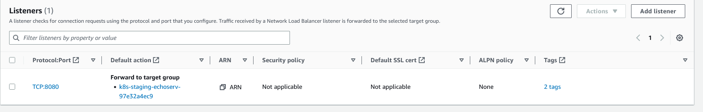

# Add terraform cloud
- Chọn 
   Version control workflow 
- Khai báo version này ở main
```python
    aws = {
      source  = "hashicorp/aws"
      version = "= 3.74.2"
    }
```
- Thêm biến ở cloud
    variables 
    **AWS_ACCESS_KEY_ID** 
    **AWS_SECRET_ACCESS_KEY** 

# Workspace Settings
- Learn-Terraform-EKS/production
# Trigger
- VCS Triggers
- Automatic Run Triggering
- Chọn Only trigger runs when files in specified paths change
# API Gateway
- Sau khi triển khai module EKS thành công get kubeconfig về apply demo echo yaml
```python
aws eks update-kubeconfig --name Demo-Prod-EKS-Cluster --profile chungndinh --region ap-southeast-1
```
```python
kubectl apply -f .\eks\

```
- Phần annotations nhớ chọn load balancer nlb. Khi apply xong config sẽ tạo ra Load Balancer ở subnet private.
```python
  annotations:
    service.beta.kubernetes.io/aws-load-balancer-type: nlb
    service.beta.kubernetes.io/aws-load-balancer-internal: "true"
```
- Copy ARN của listener và paste vào integration_uri trong resource aws_apigatewayv2_integration.eks 

- Phần này cải tiến nên lấy tự động
- Sau khi apply terraform check lại bằng 
```python
curl https://kns68jmqri.execute-api.ap-southeast-1.amazonaws.com/dev/echo
```
